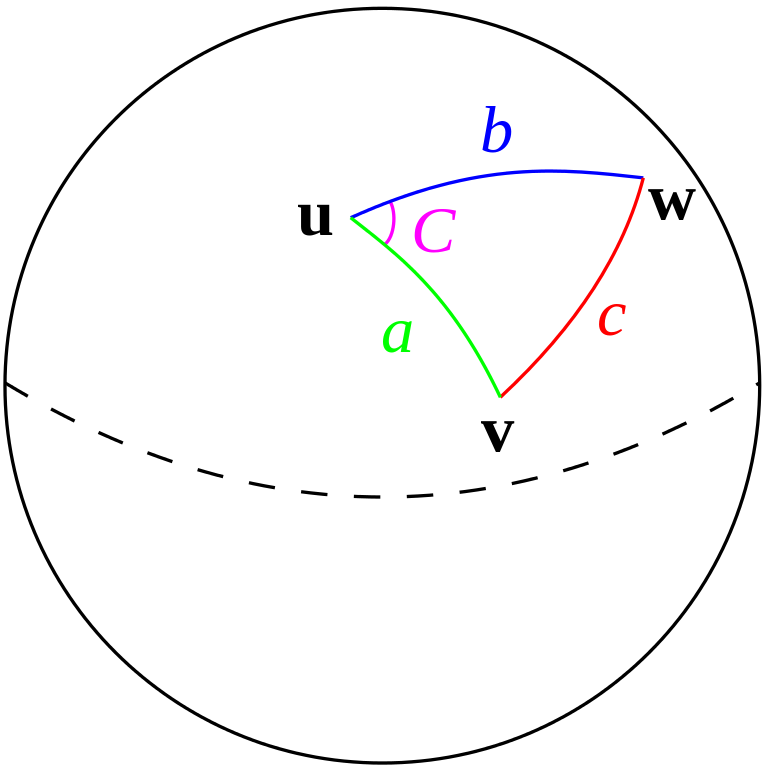
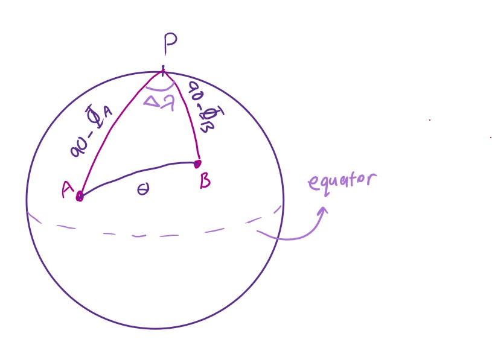

# Part 1 : EDA

```{r setup, include=FALSE}
knitr::opts_chunk$set(echo = TRUE)

library(lemon) #to print dfs in a pretty way

knit_print.data.frame <- lemon_print
library(dplyr)
library(purrr)
library(tidyr)
library(set6)
library(ggmap)
library(ggplot2)
library(ggforce)
library(car)
library(lubridate)
library(HistogramTools)
library(corrplot)
library(PerformanceAnalytics)
library("Hmisc")
library(jsonlite)
require(RJSONIO) 
library(DT)
library(broom)
library(comprehenr)
library(kdensity)
library("ggpubr")
library("gplots")
library(data.table)
library(rworldmap)


```

At first, we import the data and take a glance at what it actually looks like.

```{r, render=lemon_print}

df <- read.csv(file = 'lyon_housing.csv')

head(df,10)

```

## Empty Cells

In order to find out how much of the data is usable, the first thing we must do is to find out how many cells are actually *empty* or *Na*. These are what we'll refer to as **missing values** later.

```{r}

print(apply(is.na(df),2,sum))

```

As we can see, these values are missing:

 **surface_effective_usable = 14491**
 
 **latitude = 143**
 
 **longitude = 143**
 
I wonder if missing latitudes and longitudes are all of the same rows because the number of those missinf is exactly the same.

```{r}

lat_miss = which(is.na(df$latitude))

long_miss = which(is.na(df$longitude)) 

all(lat_miss == long_miss)

```
Thus, we have totally 143 houses (rows) that miss coordinates and all the other values have both latitude and longitude.

## Map the area covered

Now I want to draw a map just to realize what area on earth is covered in our dataset thus I remove all those rows that miss coordinate values and then draw the map. Also I'm gonna add a color gradient on price column to see if prices are significantly higher in some areas.

```{r}

#remove all rows with a Na value
#df_noNa <- na.omit(df)


df <- df %>% drop_na(longitude, latitude)


#first draw this to check if the map has proper zoom
sp = ggplot(df, aes(x = longitude, y = latitude, colour = price , shape =type_property)) + geom_point()

show(sp)


```


```{r}

#set borders of the map 

# border <- c(
#   left = min(df$longitude)-(min(df$longitude)*0.1),
#   bottom = min(df$latitude)-( min(df$latitude)*0.1),
#   right = max(df$longitude)+(max(df$longitude)*0.1),
#   top = max(df$latitude)+(max(df$latitude)*0.1)
# )


border <- c(
  left = min(df$longitude),
  bottom = min(df$latitude),
  right = max(df$longitude),
  top = max(df$latitude)
)

#get map image

map <- get_stamenmap(
  bbox = border,
  zoom = 10
)

```

```{r}
ggmap(map)+
geom_point(
    data = df,
    mapping = aes(x = longitude, y = latitude, color = price, shape = type_property)
    , size = 1.5
  )+ scale_color_gradientn(colours=c("darkorchid1","red"))+scale_shape_manual(values = c(4,15))


```

It seems like most of reddish points are shaped in square so later we'll check if *houses* are generally more expensive than apartments.

## Add price/area column

The area of the house affects its price. To compare prices, it is useful to add a column for price per $m^2$

```{r}
price = df[, 9]
area = df[, 5]
ppm = price / area

df['price_per_meter'] <- ppm
```


## Find out value ranges/types of each column

For further analysis we need to know what are the values of each column.

```{r}

for (column in colnames(df) ){
  print(as.Set(df[column]))
}

```
We have two columns that show date, Thus we reformat those values to optimize them for later calculations. Since the *hour* of construction means nothing, we omit those values. Besides, the time seems to be only two values. let's check:

```{r}
modified = strptime(df[['date_construction']], "%Y/%m/%d %H:%M")
time = format(modified, format = "%H:%M:%S")
print(as.Set(time))
```
```{r}
#DO NOT run these lines more than once

df$date_construction = strptime(df[['date_construction']], "%Y/%m/%d")
df$date_construction = as.Date(df$date_construction, format= "%Y-%m-%d")
df$date_transaction = strptime(df[['date_transaction']], "%Y/%m/%d")
df$date_transaction = as.Date(df$date_transaction, format= "%Y-%m-%d")

```

Also if construction date is in the future and sale type isn't sale before completion, then data is wrecked and must be removed. However since we know data of this column has been generated by adding 2 years to the date of generating map for house, we don't change this column to the date when house's map had been produced and just let it be. This is just a 2 year shift in data and since it's constant, has no serious affect on our analysis.

```{r}
now =as.Date(Sys.Date(), format= "%Y-%m-%d")

year(now)<-year(now)-2000

#this is rows that have messed up values! 
future = subset(df, date_construction > now & date_construction < "0090-01-01" & type_purchase != "VEFA" )


#remove
#df <- df[(df$date_construction > now & df$date_construction < "0090-01-01" & df$type_purchase != "VEFA"),]


```


For better comprehension of price range and property type, let's draw two charts:

```{r}

barplot(table(df$type_property),col="purple",horiz = T)

  # plot the histogram
  hist(df$price, main = paste('Prices Distribution'), xlab = 'Price', ylab = 'Count', col="purple",probability = T )
  
  # fit a normal curve to the histogram
  lines(density(df$price), col="magenta", lwd=3) # add a density estimate with defaults
  lines(density(df$price, adjust=2), lty="dashed", col="darkblue", lwd=3) 
  

  
# Adding a legend
legend("topright", c("fit normal", "real curve" ),
       lty = c(2, 1), col = c("darkblue","magenta"), box.lty = 4, lwd = 3)


```

## Correlation between columns

Earlier we saw correlation between surface, effective surface and room count. Instead of finding out correlation two by two we use the code below to get it far all columns all at once. I remove geographical coordinates since they don't provide us much information when treated as numbers. I used *use = "pairwise.complete.obs"* because we have a fair amount of missing data and so we would be looking for a sensible multiple imputation strategy to fill in the spaces. 


```{r}
num_cols =unlist(lapply(df, is.numeric))  
cor_df = df[,num_cols]

cor_df = cor_df[,-which(names(cor_df) %in% c("latitude","longitude"))]


res <-cor(cor_df, use = "pairwise.complete.obs")

corrplot(res, type = "upper", order = "hclust", 
         tl.col = "black", tl.srt = 45)

```

As we can see effective surface and surface have high correltion.

Before plotting the rest of the columns, we remove missing values and try to remove some columns that don't provide us fresh information.

```{r}

#?cor

df_noNa =na.omit(df[,c('surface_housing','surface_effective_usable')])

cor_effective_surface = cor(df_noNa$surface_housing, df_noNa$surface_effective_usable)

cor_room = cor(df$surface_housing, df$rooms_count)

print(paste("correlation of surface and effective surface = ",round(cor_effective_surface,4)))

print(paste("correlation of surface and effective surface = ",round(cor_room,4)))

```

Although both room count and effective surface seem related to house surface but effective surface has larger correlation, they almost represent the same thing and thus we remove *surface_effective_usable* column. This column already contains 14491 missing values and since *surface_housing* is rounded to the lowest integer, comparing *surface_effective_usable* to it is useless because sometimes *surface_effective_usable* is even larger than *surface_housing* by a fraction. But we know that is because the fraction part of *surface_housing* is removed.

```{r}

df = df[,-which(names(df) %in% c("surface_effective_usable"))]

```

So lets draw correlation matrix once again and take a look at relation between columns:


```{r}

#separate numeric columns
my_data <- df[, c(4:8)]
chart.Correlation(my_data, histogram=TRUE, pch=19)

```
```{r}
num_cols =unlist(lapply(df, is.numeric))  
cor_df = df[,num_cols]

cor_df = cor_df[,-which(names(cor_df) %in% c("latitude","longitude"))]


res <-cor(cor_df, use = "pairwise.complete.obs")

corrplot(res, type = "upper", order = "hclust", 
         tl.col = "black", tl.srt = 45)


```


### Plotting the rest of columns' distribution

Now we draw diagrams for the rest of the columns

```{r}
hist(df$parkings_count, xlab = 'Number of Parking spots', col = 'darkorchid1',  main = 'Parking Count Histogram')

hist.1 = hist(df$rooms_count, main = 'Number of Rooms', xlab = 'number', col = 'magenta3')

#hist.trimmed = TrimHistogram(hist.1)

hist(df$surface_housing, main = 'Surface Housing', xlab = 'Area', col = 'darkorchid3')
# lines(density(df$surface_housing), col="magenta", lwd=3) # add a density estimate with defaults
# lines(density(df$surface_housing, adjust=2), lty="dashed", col="darkblue", lwd=3) 
# 

barplot(table(df$type_purchase), col = "mediumorchid")

barplot(table(df$district), col = "mediumorchid3")

```

Now we plot the scatter plot for room count and area

```{r}

barplot(table(df$rooms_count), col = "mediumorchid4", main = 'room count barplot')

```
This chart is good for finding out outliers and ranges but shows nothing about the relation between number of rooms and area. We'll discuss this in next parts.


## Outliers

### Univariate approach

For a given continuous variable, outliers are those observations that lie outside 1.5 * IQR, where IQR, the ‘Inter Quartile Range’ is the difference between 75th and 25th quartiles. Look at the points outside the whiskers in below box plot.


```{r}

outlier_values <- boxplot.stats(df$price)$out  # outlier values.

boxplot(df$price, main="Price")

boxplot(df$surface_housing, main="Surface Housing")
```

We can also detect outliers for different ranges:

For prices, we analyze it based on two values: type of property and area

```{r}

boxplot(price ~ surface_housing, data=df, main="Boxplot for price vs surface", col = 'darkorchid1')

boxplot(price ~ cut(surface_housing, pretty(df$surface_housing)), data=df, main="Boxplot for price (categorial) vs surface", cex.axis=0.5, col = "magenta4",xlab = 'Area')

boxplot(price ~ type_property, data = df, col = 'mediumorchid1'
)


```

We can do the same for rooms count

```{r}

boxplot(rooms_count ~ surface_housing, data=df, col = 'purple',main="Boxplot for rooms count vs surface")

boxplot(rooms_count ~ cut(surface_housing, pretty(df$surface_housing)), xlab = 'Area',data=df, col = 'purple', main="Boxplot for rooms count (categorial) vs surface", cex.axis=0.5)


```

This is where plots get interesting! except for a few outliers, number of rooms increase almost linear to surface, however after a point, number of room remains constant while surface increases. It seems like, for houses larger than a certain value, people prefer larger rooms than more number of rooms. 


## Adding subway station file

we import the *.json* file and load it into a data frame. Then again draw their map and try to find the nearest station to each house. We'll add a new column for this value and this will help us in part 3.

The station file contains station names, latitude and longitude for each. 

```{r, render = lemon_print}
json_file  <- fromJSON('station_coordinates.json')


#unlist the json file
json_file <- lapply(json_file, function(x) {
  x[sapply(x, is.null)] <- NA
  unlist(x)
})


stations = c()
lat = c()
long = c()

#iterate through json list and store data in vectors

for (i in (1:length(json_file))){
  atomic_vec = json_file[[i]]
n=length(atomic_vec)/3

for (j in (1:n)){
  stations = c(stations, atomic_vec[[j]])
}

for (j in ((n+1):(2*n))){
  lat = c(lat, atomic_vec[[j]])
}
for (j in ((2*n+1):(3*n))){
  long = c(long, atomic_vec[[j]])
}

}


station_df <- data.frame(stations, lat, long)

head(station_df)

```

To calculate distance, We use spherical geometry to extract distance from geo coordinates. (I studied Astronomy Olympiad :) )



for angle $c$ in above picture we have:

$$\cos(c) = \cos(a)\cos(b)+ \sin(a)\sin(b)\cos(C) $$
to use this formula in our problem, place $u$ on north pole:




Thus the formula becomes like this:

$$\cos(\theta) =\sin(\phi_a)\sin(\phi_b)+  \cos(\phi_a)\cos(\phi_b)\cos(\Delta \lambda) $$
where $\phi$ is latitude and $\lambda$ in longitude. To get distance in meters:

$$d = \theta^{rad}\times R_{\oplus} $$
where $R_{\oplus}  = 6378000$ is radius of earth.

```{r}

#convert degrees to radians
to_rad <- function(x){
  return (x*pi/180)
}

measure_distance <- function(phi1,phi2,l1,l2) {
  phi1 = to_rad(phi1)
  phi2 = to_rad(phi2)
  l1 = to_rad(l1)
  l2 = to_rad(l2)
  
  delta = abs(l1-l2)
  
  theta = sin(phi1)*sin(phi2)+cos(phi1)*cos(phi2)*cos(delta)
  d = acos(theta)*6378000
  
  return (d)
}

min_distance <- function(x, y) {
  all_d = c()
  for (i in (1:nrow(station_df))){
    all_d = c(all_d, measure_distance(x,as.numeric(station_df$lat[i]),y,as.numeric(station_df$long[i])))
  }
    
  return(min(all_d))
}


closest <- function(x, y) {
  all_d = c()
  for (i in (1:nrow(station_df))){
    all_d = c(all_d, measure_distance(x,as.numeric(station_df$lat[i]),y,as.numeric(station_df$long[i])))
  }
  i <- which.min(all_d)
  return(station_df$stations[i])
}


```

Now we add two columns: 1. distance to the closest station and the name of that station.

```{r}
new_col = c()
for (i in 1 : nrow(df)){
  
  new_col = c(new_col, min_distance(as.numeric(df[['latitude']][i]), as.numeric(df[['longitude']][i])))
  
}

df['closest_distance'] <- new_col
```

```{r}
new_col = c()
for (i in 1 : nrow(df)){
  
  new_col = c(new_col, closest(as.numeric(df[['latitude']][i]), as.numeric(df[['longitude']][i])))
  
}

df['closest_station'] <- new_col

```

let's draw a chart:

```{r}
hist(df$closest_distance, main='Distance to Nearest Station', xlab = 'distance', col = 'orchid')
  
  
```
 Now we draw the correlation matrix again.
 
```{r}
num_cols =unlist(lapply(df, is.numeric))  
cor_df = df[,num_cols]

cor_df = cor_df[,-which(names(cor_df) %in% c("latitude","longitude"))]


res <-cor(cor_df, use = "pairwise.complete.obs")

corrplot(res, type = "upper", order = "hclust", 
         tl.col = "black", tl.srt = 45)
```
As we can see, our new column **closest distance** in not correlated to any of other columns.

#Part 2 : Inference & Visualization

## 1: correlation between rooms_count and surface_housing

Earlier we saw a relation between number of rooms and area. Here I use room count as a dummy variable and see if the regression gets better or not. To do this we must create a new data frame and also we know that room count column ranges from 1 to 6. thus we put 5 columns for room counts and 6 (or more) will be the indicator. 

We'll also do the same for district. If columns dist 1 to 9 are all zero then district is "Villeurbanne".

```{r}
y = df$rooms_count
x = df$surface_housing

# Change point shape (pch = 19) and remove frame.
plot(x, y, main = "room count vs area",
     xlab = "area", ylab = "number of rooms",
     pch = 19, frame = FALSE)
abline(lm(y ~ x, data = df), col = "purple")
lines(lowess(x, y), col = "blue")

scatterplot(rooms_count ~ surface_housing, data = df, col = 'purple')
```


```{r, render=lemon_print}

#import data
tosave = data.frame(room1 = c(0),room2 = c(0),room3 = c(0), room4= c(0),room5 = c(0),dist1 = c(0),dist2= c(0),dist3 = c(0),dist4 = c(0),dist5 = c(0),dist6= c(0),dist7= c(0),dist8 = c(0),dist9 = c(0),area= c(0))


room_vec <- function(n) {
  if (n > 5){
    return(c(rep(0,5)))
  }
    vec = c(rep(0,5))
    vec[n] <- 1
    return (vec)
}


which_dist <- function(dist) {
    vec = c(rep(0,9))
    if (dist == "Villeurbanne"){
      return(vec)
    }
    if (dist == "Lyon 1er Arrondissement"){
      vec[1] <- 1
    }
    if (dist == "Lyon 2e Arrondissement"){
      vec[2] <- 1
    }
    if (dist == "Lyon 3e Arrondissement"){
      vec[3] <- 1
    }
    if (dist == "Lyon 4e Arrondissement"){
      vec[4] <- 1
    }
    if (dist == "Lyon 5e Arrondissement"){
      vec[5] <- 1
    }
    if (dist == "Lyon 6e Arrondissement"){
      vec[6] <- 1
    }
    if (dist == "Lyon 7e Arrondissement"){
      vec[7] <- 1
    }
    if (dist == "Lyon 8e Arrondissement"){
      vec[8] <- 1
    }
    if (dist == "Lyon 9e Arrondissement"){
      vec[9] <- 1
    }
    
    return (vec)
}


#######copy: the damn loop takes 30 minutes to complete!
# 
#   for (row in rownames(df)) {
#     print(row)
#           tosave[nrow(tosave) + 1,] = c(room_vec(as.numeric(df[row,4])),which_dist(as.character(df[row,10])),as.numeric(df[row,5]))
#   }
#  
# ####### removing the first row which was 0 to initialize the data frame
#  tosave <- tosave[-1,]
# # 
# 
# #### because the loop takes too long to complete I ran it once and saved the result to read from it later.
# write.csv(tosave,"roomdummy.csv", row.names = FALSE)


dummydf <- read.csv(file = 'roomdummy.csv')

dummydf['total_price'] = df['price']
dummydf['price_meter'] = df['price_per_meter']

head(dummydf)
tail(dummydf)

```


now we do regression for both the dummy variable data and the original one.

```{r}
reg2 = lm(surface_housing~rooms_count , df)
reg = lm(area~room1+room2+room3+room4+room5 , dummydf)

print("regression for original data:")
summary(reg2)
print("regression for dummy variable version:")
summary(reg)
```

The $R^2$ is large and p-value is pretty small. The $R^2$ and p-values don't differ much in two versions. That might be because the number of rooms is really a number, and we except that by increasing it, observe increasing in area too. Therefore we can conclude room count and area are very much related.

**Generally finding relation between columns is important. one reason is that when we try to visualize this data, the more variables we use, the more dimensions we have and we can't plot more than 3 dimensions all at once. Thus finding relation between two columns and then removing one of them or replacing both of them with a new value that represents them, (using PCA or t-sne for example) reduces dimensions and make visualization easier.**

## 2: relation between price and district. does it exist?

Let's draw price map again but this time we use price per meter so that the size of the house doesn't affects our analysis.


First we draw a map to make distinction between districts visible. 

```{r}

ggplot() +geom_point( data=df, aes(y=latitude, x=longitude, color = as.factor(district)), size = 0.4)

```

Now draw price gradient for both total price and price per meter

```{r}
print("price per meter")
ggmap(map)+
geom_point(
    data = df,
    mapping = aes(x = longitude, y = latitude, color = price_per_meter, shape = type_property)
    , size = 1.5
  )+ scale_color_gradientn(colours=c("black","red"))+scale_shape_manual(values = c(4,15))


print("price")
ggmap(map)+
geom_point(
    data = df,
    mapping = aes(x = longitude, y = latitude, color = price, shape = type_property)
    , size = 1.5
  )+ scale_color_gradientn(colours=c("black","red"))+scale_shape_manual(values = c(4,15))


```


From what we saw in first part when we drew map, it seemed like prices of different areas was higher or lower. However now comparing both maps we see that, the difference might be because of houses being larger in different districts rather than more expensive. To make sure of this we do a regression model.

```{r}
model <- lm(price_per_meter ~ district, data = df)
summary(model)

```

The $R^2$ is close to 0 and is very low. Thus district and price are not correlated and in opposition to what we might think, prices in different districts don't differ.

Here is a histogram of each district's mean price/meter

```{r}

dists = unique(df[c('district')])

mean_dist_price = c()

for (i in (1:nrow(dists))){
  word = as.character(dists[i,1])
  filtered <- df[as.character(df$district) == dists[i,1],]
  
  mean_dist_price <- c(mean_dist_price, mean(filtered$price_per_meter))
}
  

par(mar=c(11,4,4,4))

barplot(mean_dist_price,
        main = "distrinct mean prices",
        ylab = "mean price",
        names.arg = dists$district, cex.names  = 1,las =2,
        col = "hotpink")

```
However the correct way to model a regression between price and district is to use them as dummy variables. Let's do this

```{r}

reg = lm(price_meter~dist1+dist2+dist3+dist4+dist5+dist6+dist7+dist8+dist9 , dummydf)
print("regression for dummy variable version of price/meter vs district:")
summary(reg)

```
The R-squared is very low and thus district is only responsible for 16% of changes in price. One interesting thing is that dist6 has highest coefficient, and we saw earlier that dist6 had the highest mean. Also dist9 has the smallest coefficient as in histogram has the lowest height.

But here we want to compare districts and the goal isn't to predict price or model it as a function of other variables. price may not entirely depend on district, while still there can be meaningful differences between average prices of districts. Besides, modeling price as a function of just districts, will result in a regression model using **just** dummy variables which isn't the best way to get our answer. Therefore for more accurate analysis, we compare districts two by two and do a t-test to find out what districts have meaningful difference. Looking at the histogram, we see that for example districts 2 and 6 have approximately same average but district 5 and 6 are significantly different.

In the t-test, the null hypothesis is that difference in means is 0. (two groups have same average and aren't different). The alternative is that there **is** a difference between means. With a threshold of 0.05 we'll fail to reject the null hypothesis if p-value > 0.05 and that would mean with confidence level of 95%, there isn't meaningful difference between the price of those districts.

```{r, render = lemon_print}

#initialize frame
  word = as.character(dists[1,1])
  major = df[df$"district" == word, c("price_per_meter")]
  minor = df[df$"district" == as.character(dists[1,1]), c("price_per_meter")]
  res = t.test(major,minor)
  temp = c(word,as.character(dists[1,1]),tidy(res))
  tdf = data.frame(temp)
  tdf = tdf[-1,]
  
#iterate through districts and compare each with other ones.
for (i in (1:nrow(dists))){
  if (i == 10){
    break
  }
  word = as.character(dists[i,1])
  major = df[df$"district" == word, c("price_per_meter")]
  
  
  for (j in ((i+1):nrow(dists))){
    minor = df[df$"district" == as.character(dists[j,1]), c("price_per_meter")]
    res = t.test(major,minor)
    temp = c(word,as.character(dists[j,1]),tidy(res))
    tdf[nrow(tdf)+1,] = temp
  }
  

}
  

head(tdf,'all')

```

the districts that have no meaningful difference in price are:

```{r}
tdf[which(tdf$'p.value'>0.05),]
```

This result indicates that all district have different prices expect for districts 1 and 4, and 2 and 6 that have same average.

looking at the histogram this result might seem bizarre since it seems like districts 5 and 9 also have the same height but t-test says otherwise. It's because the bars aren't next to each other and comparing them with naked eye causes error. We can also look at the averages:

```{r}
print(mean_dist_price)
```

districts 1 and 4 means are respectively 4653 and 4637 which is really close thus the difference is 16 (0.3%) . Also districts 2 and 6 means are  5023 and 5106 respectively thus the difference is 83 (1%). These two groups were known as *same* in the t-test. But districts 5 and 9 means are 3580 and 3468 respectively thus the difference is 112 which is significantly high (3%) and that's why in t-test 5 and 9 were concluded to be different in prices.


## 3: Is the price distribution normal?

In this part we check whether the prices we have in our data set comes from a normal distribution or not?

Note that for this part we'll use price per meter values to prevent size of house to interfere with our analysis.

We start by displaying a random sample of 10 rows using the function sample_n()[in dplyr package].

There are several methods for normality test such as Kolmogorov-Smirnov (K-S) normality test and Shapiro-Wilk’s test.

The null hypothesis of these tests is that “sample distribution is normal”. If the test is significant, the distribution is non-normal.

Shapiro-Wilk’s method is widely recommended for normality test and it provides better power than K-S. It is based on the correlation between the data and the corresponding normal scores.

The R function shapiro.test() can be used to perform the Shapiro-Wilk test of normality for one variable (univariate):

```{r}
set.seed(13)

#Show 10 random rows:
dplyr::sample_n(df, 10)

```
first we remove outliers:

```{r}
outliers <- boxplot(df$price_per_meter, plot=FALSE)$out

x<- df[-which(df$price_per_meter %in% outliers),]
```


```{r}

plot(density(df$price_per_meter),main = "Density plot of price/meter (Original)",xlab = "Price/Meter")

plot(density(x$price_per_meter),main = "Density plot of price/meter (after removing outliers)",xlab = "Price/Meter")

#ggqqplot(df$price)


```
We also draw a histogram and fit a normal curve on it:

```{r}
g = df$price_per_meter

h <- hist(g, breaks = 100,
          col = "mediumpurple3", xlab = "Price/meter", main = "Overall") 
xfit <- seq(min(g), max(g), length = 400) 
yfit <- dnorm(xfit, mean = mean(g), sd = sd(g)) 
yfit <- yfit * diff(h$mids[1:2]) * length(g) 

lines(xfit, yfit, col = "red", lwd = 2)

```
Now we do the normality test:

```{r}

set.seed(2)

#Show 10 random rows:
sample <- dplyr::sample_n(x, 100)
shapiro.test(sample$price_per_meter)


```


With a threshold of 0.05 for p-value, if $p_{value} > 0.05$ then with significance level of $95%$ we fail to reject the null hypothesis. Since p-value is much more than $0.05$ we fail to reject the normality of the price distribution and with probability more than $95%$ the price distribution is normal.


## 4: Is the area distribution normal?

Finding out that price is mostly affected by surface housing (in part 1, where we drew correlation matrix), and the fact that it has normal distribution made me wonder if area too had a normal distribution. So we'll repeat everything for area 

```{r}
set.seed(13)

#Show 10 random rows:
dplyr::sample_n(df, 10)

```

first we remove outliers:

```{r}
outliers <- boxplot(df$surface_housing, plot=FALSE)$out

x<- df[-which(df$surface_housing%in% outliers),]
```


```{r}

plot(density(df$surface_housing),main = "Density plot of area (Original)",xlab = "Price/Meter")

plot(density(x$surface_housing),main = "Density plot of area (after removing outliers)",xlab = "Price/Meter")

#ggqqplot(df$price)


```
```{r}

set.seed(2)

#Show 10 random rows:
sample <- dplyr::sample_n(x, 100)
shapiro.test(sample$surface_housing)


```

Even though it may not look like it, but due to $P_{value} > 0.05$ we fail to reject that distribution is normal

**why 3 and 4 indicate useful results? **

Knowing the distribution of something makes it predictable and easier to estimate. For some important parameter like price, knowing such thing has its own benefits. It can also help us find out prices that are significantly high ar low. 

(For example if the price is really low you should suspect that the house is haunted, and you don't wanna live in it and turn your life into a nightmare. )

## 5: Relation between price and surface housing

We expect for larger houses to be more expensive, however we don't expect that price per meter to change with area of the house.


```{r}
model = lm(formula = price ~ surface_housing, df)

summary(model)

plot(df[['surface_housing']], df[['price']], main = paste('Housing Price'), xlab = 'Area', ylab = 'Price', col = 'mediumpurple')
abline(model,lwd= 4, col = 'lightslateblue') 

```
We can use slope and its standard deviation to calculate a confidence interval for the real slope (and not just the slope for sample)

$$I = [\mu - 1.96\sigma , \mu + 1.96\sigma] $$
where 1.96 is the 95% confidence interval for standard normal distribution.
$$ \mu = 4092.05$$
$$\sigma = 18.09 $$
$$ I =  [4056, 4127]$$
obviously $0 \notin I$ Thus with 95% probability area and price have linear relation. (well who didn't already know this? :) )

However doing exact the same things for price/meter and area:


```{r}
model = lm(formula = price_per_meter ~ surface_housing, df)

summary(model)

plot(df[['surface_housing']], df[['price_per_meter']], main = paste('Housing Price'), xlab = 'Area', ylab = 'Price/meter', col = 'mediumpurple')
abline(model,lwd= 4, col = 'lightslateblue') 


```
Looking at $R^2$ and plots we'll instantly realize that area is responsible for almost $50%$ of changes in price but has nothing to do with price/meter since the line is horizontal and R-squared is very close to 0.

## 6: Closer to station, more expensive?

One might think the closer a house is to a station, the more expensive it must be, because of the benefit of its location. Let's check this out.

```{r}
model = lm(formula = price_per_meter ~ closest_distance, df)

summary(model)

plot(df[['closest_distance']], df[['price_per_meter']], main = paste('Housing Price vs distance to station'), xlab = 'distance to closest station', ylab = 'Price', col = 'mediumpurple')
abline(model,lwd= 4, col = 'lightslateblue') 


```

Despite a slight negative slope, it doesn't seem that this parameter has much effect on price. nevertheless r-squared is very close to 0 too.

## 7: Price and everything else!

In previous part we analyzed the relation between price and some other factors separately. Now we'll try to model price as a function of more than one parameter. We saw that area is responsible for 50% of changes in price. We also saw that district has a slight affect on it.

```{r}
#remove price per meter column and room count
dummydf3 = dummydf[,-c(1,2,3,4,5,17)]

model = lm(formula = price~., dummydf3)

summary(model)


```
The R-squared is very large! This means that, district and area together determine a very large part of the total price.
## 8: Different prices for different years

In previous part we didn't consider time to have an affect on price. In this part we try to check price/meter mean for each district but this time separately for each year.

```{r}
#create new df and add required data to it:

td = df[,c(10,14)]
td['year'] <- year(df$date_transaction)


dists = unique(td[c('district')])
years = unique(td[c('year')])


tdy = data.frame(district = c(0), year = c(0) , mean_price_meter = c(0))

for (i in (1:nrow(dists))){
  
  word = as.character(dists[i,1])
  
  filtered <- td[as.character(td$district) == word,]
  
  for (j in (1:nrow(years))){
  
    y = as.numeric(years[j,1])

    filtered2 <- filtered[as.numeric(filtered$year) == y,]
  
    mdtp <-  mean(filtered2$price_per_meter)
    
    if(!is.na(mdtp)){
      tdy[nrow(tdy)+1,] = c(word , y , mdtp)
    }
  }
}
  
#remove first row:
tdy = tdy[-1,]

# from 1990 to 2023

newyear = tdy$year

 for (j in (1:nrow(years))){
    y = as.numeric(years[j,1])
    if (-1 < y & y < 24){
    newyear[newyear == y] <- 2000+y
    }
    else{
      newyear[newyear == y] <- 1900+y
    }
 }

tdy['year'] = newyear

#tdy = tdy[order(tdy$year),]

tdy$mean_price_meter =as.numeric(as.character(tdy$mean_price_meter))

tdy$mean_price_meter  = round(tdy$mean_price_meter )

tdy$year =as.numeric(as.character(tdy$year))

ggplot(tdy,aes(x = year, y = mean_price_meter, group = district))+geom_line(aes(color = district) )+geom_point(aes(color = district))


```


```{r}

tdyear <- summarise_at(group_by(td, year), vars(price_per_meter), mean)


ggplot(tdyear , aes(x=year, y=price_per_meter)) + geom_line(color = "purple") +geom_point( color = "mediumorchid", size = 3) + ggtitle("Average housing prices/meter vs. Year")

model = lm(price_per_meter ~ year, tdyear)

summary(model)


```
The R-squared is 0.98! Almost 1. the R-squared for district was 0.16 and 0.005 for area (recall that it's price per meter we're talking about). It seems like the most important factor that affects price/meter is time rather than location.

**The fact that prices grow larger with time show inflation, and analysis of price over time can be very useful for economical means**


## 9: Are maisons larger than appertments?

```{r}

h <- df[, c('rooms_count', 'type_property')]

freq <- dcast(as.data.table(h), rooms_count ~ type_property)

freq <- freq[, -1]

dt <- as.table(as.matrix(freq))

balloonplot(t(dt), main = "housetasks", xlab = "type_property", ylab = "rooms_count", label = TRUE, show.margins = FALSE)


boxplot(surface_housing ~ type_property , xlab = 'type of property',data=df, col = 'purple', main="Boxplot for type propertyvs surface")
```
The plot shows us higher average for maisons' surface. However the plots are not very obvious for rooms count. most apartments have 3 rooms and most houses have 4 rooms. he difference is so little that, we can't just make a conclusion out of these plots. Now we test our hypothesis with t-test.


```{r}

house = df[df$"type_property" == "maison", c("surface_housing")]
appart = df[df$"type_property" == "appartement", c("surface_housing")]
room_app = df[df$"type_property" == "appartement", c("rooms_count")]
room_house = df[df$"type_property" == "maison", c("rooms_count")]


res = t.test(house,appart)

res2 = t.test(room_house,room_app)

print("t-test result for surface housing")
res
print("t-test result for rooms count")
res2
```
Thus with probability $95%$, The averages are not equal. In fact because $p_{value} < 0.01$ then with 99% confidence level, two groups have different means and thus maisons are generally larger than apartments.


# Part 3 :  Where to buy a house?


I would want a house with below properties.

#### 1. Close to university

#### 2. Close to station

#### 3. Room number of 3 or 4

#### 4. Area between 50 to 100

#### 5. The lower the price the better!

#### 6. Type doesn't matter

#### 7. I don't have a car so parking doesn't matter

Thus the first thing is to fix the location of the house. since all prices and area can be found in all districts, I choose district based on closeness to university at first. Let's draw a map of districts again but this time also show university location on it.


```{r}
#coordinates of university
unilong = 4.8655
unilat = 45.7802

ggplot() +geom_point( data=df, aes(y=latitude, x=longitude, color = as.factor(district)), size = 0.4)+geom_circle(aes(x0 = unilong, y0 = unilat, r = 0.005))


```
The university is in **Villeurbanne**. From the location of it, (which isn't on the border of district and close to any other one), It'll be idiotic to buy house anywhere else. However district 6 is also close But if you recall Part 2.1 where we drew histograms of prices, **Villeurbanne** was one the cheapest districts and 6 was the most expensive! Here we have it again:

```{r}

dists = unique(df[c('district')])

mean_dist_price = c()

for (i in (1:nrow(dists))){
  word = as.character(dists[i,1])
  filtered <- df[as.character(df$district) == dists[i,1],]
  
  mean_dist_price <- c(mean_dist_price, mean(filtered$price_per_meter))
}
  

par(mar=c(11,4,4,4))

barplot(mean_dist_price,
        main = "distrinct mean prices",
        ylab = "mean price",
        names.arg = dists$district, cex.names  = 1,las =2,
        col = "hotpink")
```
Thus I choose **Villeurbanne** over district 6 because of the prices.

To come up with further detail, we filter only houses in this district:

```{r}
vil <- filter(df, district == "Villeurbanne")

#some coordinates are missing. I don't want those that don't have coordinates
vil <- na.omit(vil)

#reset index
rownames(vil) <- NULL

```

Then we design a formula to give each house a certain score based on properties we desire. 

```{r, render = lemon_print}

score_func <- function(i) {
  
    room_num = vil$rooms_count[i]
    
    if((room_num < 3) || (room_num > 5)){
      # I don't want a house that has less than 3 or more than 5 rooms
      return(0)
    }
    
    area = as.numeric(vil$surface_housing[i])
    if(area < 50){
      
      # I don't want a house that is smaller than 50 m^2
      return(0)
    }
    
    
    price = as.numeric(vil$price[i])
    
    mean_price = mean(vil$price)
    
    scaled_price = (price - mean_price)/mean_price
    
    d_station = as.numeric(vil$closest_distance[i])
    
    d_uni = measure_distance(as.numeric(vil$latitude[i]),as.numeric(unilat),as.numeric(vil$longitude[i]),as.numeric(unilong) )
    
    #the larger the price, the worst! and it's the most important factor thus its coefficient is 10
    #the lesser the distances, the better! however distance to university is more important
    score = (-10*scaled_price)+(-5*d_uni)+(-3*d_station)
    
    return(score)
       
    
}

s = c()
for (i in (1 : nrow(vil))){
  s = c(s , score_func(i))
}

vil['score'] <- s


vil = vil[vil$score != 0, ]

#sort
vil <- vil[order(-vil$score),]


head(vil,20)

```

These are houses with highest score in descending order. 

And below is the score map 


```{r}

ggmap(map)+
geom_point(
    data = vil,
    mapping = aes(x = longitude, y = latitude, color = score, shape = type_property)
    , size = 1.5
  )+ scale_color_gradientn(colours=c("cyan","darkorchid1"))+scale_shape_manual(values = c(4,15))


ggplot() +geom_point( data=vil, aes(y=latitude, x=longitude, color = score), size = 1.5)+geom_circle(aes(x0 = unilong, y0 = unilat, r = 0.007))+ scale_color_gradientn(colours=c("cyan","darkorchid1"))+scale_shape_manual(values = c(4,15))


```

Here is the area where I would want to buy a house. And the first rows of *vil* data frame are the most ideal houses. 

